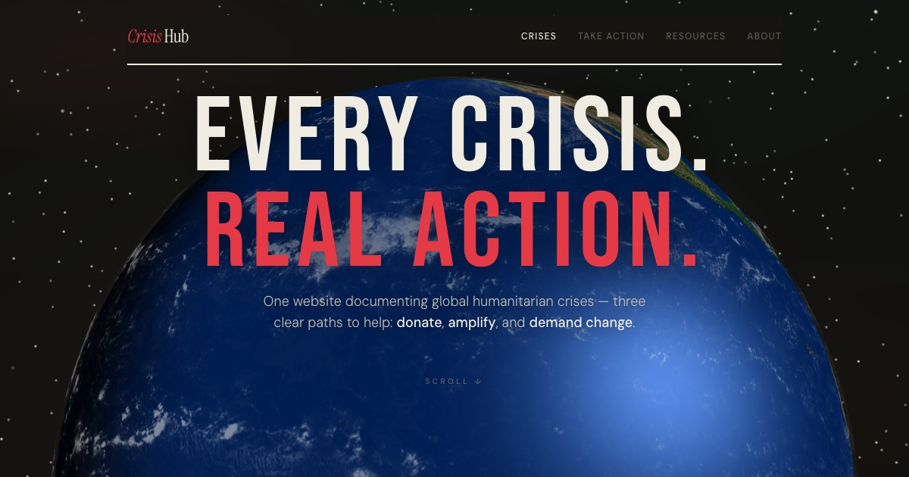

# Crisis Hub

**A free, open-source website documenting 52 global humanitarian crises and giving people actionable ways to help.**

One website. Every crisis. Three actions: **Donate**, **Amplify**, **Demand Change**.



## Highlights

- **Cinematic 3D globe** — a scroll-driven WebGL Earth built with Three.js: the camera flies from a horizon view into an interactive orbital stage where you can spin the globe, zoom with on-screen controls, and click any of 52 color-coded crisis hotspots. Rendered with 4K NASA Blue Marble imagery and a custom GLSL shader for the day/night terminator, city lights on the dark side, ocean specular shimmer, and a drifting cloud layer.
- **Live data pipeline** — a nightly GitHub Action pulls the latest situation reports for every crisis from **UN OCHA's ReliefWeb** and commits them into the site, so each crisis page carries current headlines without manual editing.
- **Smart labeling** — hotspot name labels render only for the front-facing hemisphere and scale with zoom, keeping dense regions readable.
- **Deep crisis pages** — every crisis has sourced statistics, background context, vetted donation organizations, awareness and political-action guides, licensed photography with attribution, and JSON-LD structured data.
- **Scroll choreography** — GSAP ScrollTrigger and Lenis smooth-scrolling drive the hero sequence off a single scrubbed timeline, synced to the WebGL camera at 60fps.
- **No CMS, no database** — content lives in per-crisis JSON files; every page is statically generated at build time.

## Tech Stack

- **Framework:** Next.js 14 (App Router), TypeScript, static generation
- **3D:** Three.js via @react-three/fiber + drei, custom GLSL shaders
- **Animation:** GSAP ScrollTrigger + Lenis
- **Styling:** Tailwind CSS — warm dark palette, Bebas Neue / Instrument Serif / DM Sans
- **Data:** JSON files + nightly ReliefWeb ingestion (GitHub Actions)
- **Hosting:** Vercel

## Getting Started

```bash
npm install
npm run dev        # http://localhost:3000
npm run build      # production build (SSG for all 52 crisis pages)
```

Refresh the ReliefWeb headlines manually with:

```bash
node scripts/update-reliefweb.mjs
```

## Project Structure

```
crisis-hub/
├── .github/workflows/update-data.yml   # Nightly ReliefWeb refresh
├── scripts/update-reliefweb.mjs        # UN ReliefWeb ingestion
├── public/
│   ├── textures/                       # 4K NASA Blue Marble set
│   └── images/crises/                  # Per-crisis photography (Wikimedia, attributed)
├── src/
│   ├── app/
│   │   ├── page.tsx                    # Homepage (cinematic globe + grid)
│   │   ├── crises/[slug]/page.tsx      # 52 statically generated crisis pages
│   │   ├── about/ · resources/ · take-action/
│   │   └── sitemap.ts · robots.ts · not-found.tsx
│   ├── components/
│   │   ├── cinematic/                  # WebGL hero
│   │   │   ├── CinematicHero.tsx       # Scroll runway + stage choreography
│   │   │   ├── CinematicGlobe.tsx      # Canvas, camera rig, zoom, label planner
│   │   │   ├── EarthLayers.tsx         # Day/night shader, clouds, fade-in
│   │   │   ├── Hotspot.tsx             # Pulsing markers + labels
│   │   │   └── CrisisTakeoverModal.tsx # Photos, credits, live updates, CTAs
│   │   └── ...                         # Grid, stats, tabs, nav
│   ├── data/
│   │   ├── crises/*.json               # One file per crisis (sourced)
│   │   └── reliefweb.json              # Auto-refreshed headlines
│   ├── lib/crises.ts
│   └── types/crisis.ts
└── tailwind.config.ts
```

## Adding a New Crisis

1. Create `src/data/crises/[slug].json` following the schema in `src/types/crisis.ts`
2. Include coordinates — the hotspot appears on the globe automatically
3. Provide 3–5 vetted donation organizations, awareness and political action items
4. Add sourced statistics and a detailed context section
5. The page, sitemap entry, and globe marker all generate automatically

## Content Principles

- **Cite everything** — UNHCR, WHO, ICRC, Reuters, AP, HRW, Amnesty
- **Never sensationalize** — the facts speak for themselves
- **Center affected voices** — prioritize local journalists and organizations
- **Acknowledge complexity** — no oversimplified good/evil narratives
- **Vet every organization** — Charity Navigator, GiveWell, direct research
- **Credit photography** — images are Wikimedia Commons, attributed with license in situ
- **Stay current** — nightly ReliefWeb ingestion + per-page "Last Updated" timestamps

## License

Open source, built to help people act on humanitarian crises.

---

*Built by Arman Chaudhury. The most powerful thing you can do is start — and then keep going.*
